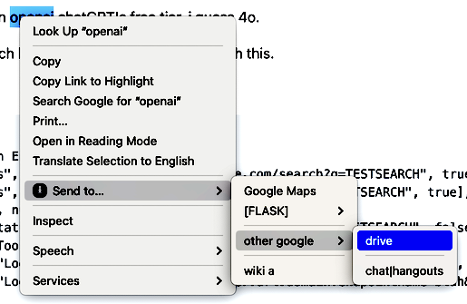

# chrome_context_menu
multi-level (aka nested) right click context menus for chrome 


1. manifest calls for some icon.png
1. developer mode for extensions needs enabled
1. load unpacked extension (after adding some icon.png)
1. right click extension, select options, adapt/paste below
## Example Config
```
[
    ["-1","Google Maps","http://www.google.com/maps/search/TESTSEARCH",true],
    ["root","[FLASK]","",true],
    ["[FLASK]","ABC","http://127.0.0.1:5000/abc?value=TESTSEARCH",true],
    ["[FLASK]","DEF","http://127.0.0.1:5000/def?why=bc&value=TESTSEARCH",true],
    ["-1","","",true],
    ["root","other google","",true],
    ["other google","drive","https://drive.google.com/drive/search?q=TESTSEARCH",true],
    ["other google","","",true],
    ["other google","chat|hangouts","https://mail.google.com/mail/u/0/#search/chat/TESTSEARCH/cmembership=1",true],
    ["-1","","",true],
    ["-1","wiki a","urla&search=TESTSEARCH",true]
]
```

# Motivation
Similar extensions exist.The ones I found were charging money for sub menus.

This was developed on openai chatGPT's free tier, i guess 4o.

its permissions are such because I plan on doing more with this.